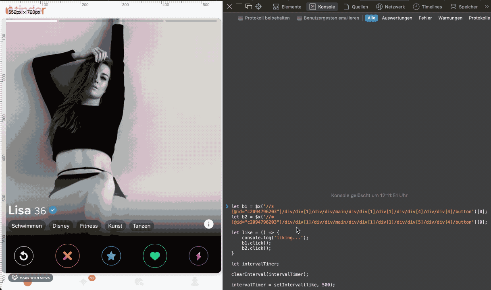

# Description

Silly weekend playaround to reduce some time spent with tinder :-)



## How-To

1. Login on tinder with Safari / Chrome / Firefox (`$x` must be available in console)
2. Open Console from developer tools
3. copy & paste below code and hit enter

   ```js
   let b1 = $x(
       '//*[@id="c2094796203"]/div/div[1]/div/div/main/div/div[1]/div[1]/div/div[4]/div/div[4]/button'
     )[0],
     b2 = $x(
       '//*[@id="c2094796203"]/div/div[1]/div/div/main/div/div[1]/div[1]/div/div[5]/div/div[4]/button'
     )[0],
     like = () => {
       b1.click();
       b2.click();
     },
     intervalTimer = setInterval(like, 500);
   ```

4. make sure to stop it when you're out of your free likes running `clearInterval(intervalTimer);`

## Tampermonkey-Script

```js
// ==UserScript==
// @name         Tinder Autoliker
// @namespace    http://tampermonkey.net/
// @version      0.1
// @description  Give everybody a like :-)
// @author       You
// @match        https://tinder.com/app/recs
// @icon         data:image/gif;base64,R0lGODlhAQABAAAAACH5BAEKAAEALAAAAAABAAEAAAICTAEAOw==
// @grant        none
// ==/UserScript==

(function() {
    'use strict';
        let likeCounter = 95;
    const doLike = () => {
        const likeBtn = document.querySelector("button[data-testid='gamepadLike']");
        if (likeBtn) {
        likeBtn.click();
        likeCounter++;
        console.log(`Liked: ${likeCounter}`);
        }
    };
    setTimeout(() => {
        const intervalTimer = setInterval(doLike, 1500);
    }, 5000);
})();
```

## Disclaimer

Tinder is constantly working on the UI, hence the Xpaths to the button might change. The script would always work with updated Xpaths though.
